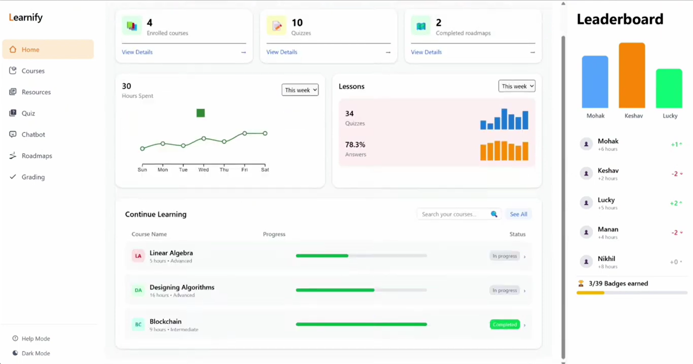
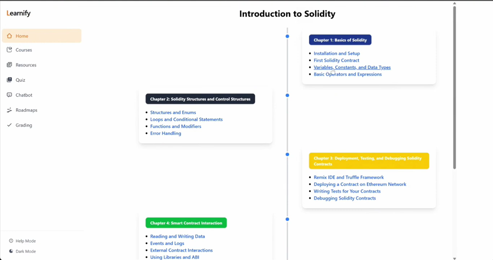
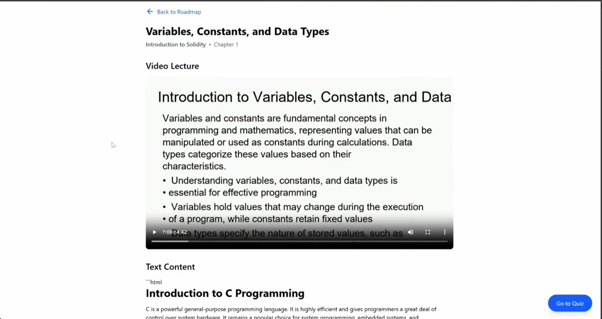
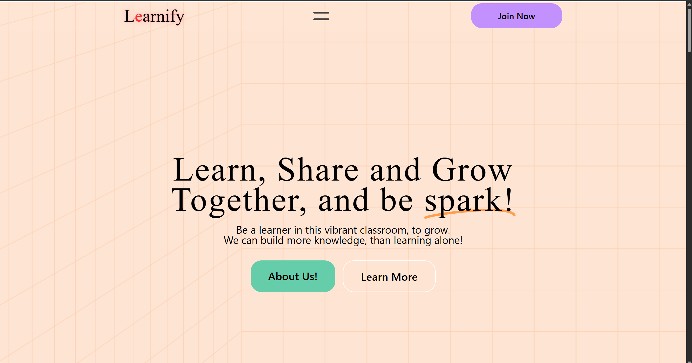

# 🚀 Learnify

> Imagine typing "Teach me Solidity" and instantly getting a custom course with video lectures, curated resources, quizzes, and even AI-powered grading for your handwritten notes. That’s what Learnify does! It adapts to your pace, gives real feedback, and keeps you motivated with gamified leaderboards.
>
> This project was a deep dive into design thinking and innovation, and I loved every bit of building it. Would you use something like this? Let me know your thoughts!

## 🌟 Features
- **🤖 Instant Custom Courses**: Generate AI-powered roadmaps for any topic you want to learn.
- **📚 Curated Resources**: Automatically aggregates video lectures, articles, and documentation.
- **📝 AI-Powered Grading**: Upload your handwritten notes and get them graded instantly with personalized feedback.
- **🧠 Interactive Quizzes**: Test your knowledge with dynamically generated quizzes.
- **🏆 Gamified Leaderboards**: Stay motivated by competing with peers on the leaderboard.
- **💬 Chatbot Assistance**: Seamless on-the-go Q&A via integrated chatbot.

## 📸 Screenshots

## 💻 Tech Stack
**Frontend:**
- React.js + Vite
- CSS / Tailwind

**Backend & Services:**
- Node.js & Express (Authentication & Main Server)
- MongoDB (User Auth & Data)
- Python (Roadmap Generator)
- Django & SQLite (Grading System)

**AI & APIs:**
- Google Gemini API (Course Generation & NLP)
- Web Scraping scripts (Resource Aggregation)

## 🚀 Getting Started

1. **Clone the repository**
   \\\ash
   git clone https://github.com/mohaksingh56/Learnify-Edtech.git
   \\\

2. **Frontend Setup**
   \\\ash
   cd frontend
   npm install
   npm run dev
   \\\

3. **Backend Services Setup**
   - **Auth Server:** cd Authentication && npm install && npm run start
   - **Main Server:** cd server && npm install && npm run start
   - **Grading System:** cd grading_system && pip install -r requirements.txt && python manage.py runserver
   - **Roadmap Generator:** cd "roadmap generator server" && pip install -r requirements.txt && python app1.0.py

---
*Built with ❤️ to redefine learning.*
